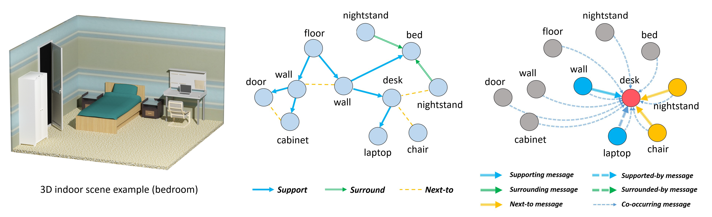

# 3DIndoor-SceneGraphNet

This repository contains a PyTorch implementation of the following paper:

> **SceneGraphNet: Neural Message Passing for 3D Indoor Scene Augmentation**
>
> [Yang Zhou](https://people.umass.edu/~yangzhou), Zachary While, [Evangelos Kalogerakis](https://people.cs.umass.edu/~kalo/)
>
> ICCV 2019
>
> **Abstract** In this paper we propose a neural message passing approach to augment an input 3D indoor scene with new objects matching their surroundings. Given an input, potentially incomplete, 3D scene and a query location, our method predicts a probability distribution over object types that fit well in that location. Our distribution is predicted though passing learned messages in a dense graph whose nodes represent objects in the input scene and edges represent spatial and structural relationships. By weighting messages through an attention mechanism, our method learns to focus on the most relevant surrounding scene context to predict new scene objects. We found that our method significantly outperforms state-of-the-art approaches in terms of correctly predicting objects missing in a scene based on our experiments in the SUNCG dataset. We also demonstrate other applications of our method, including context-based 3D object recognition and iterative scene generation. 

[[Project page]](https://people.umass.edu/~yangzhou/scenegraphnet/) [[Arxiv]](https://arxiv.org/abs/1907.11308)



Figure. An example of the graph structure used for neural message passing in SceneGraphNet for a bedroom scene.

## Requirements

- Python 3
- Python packages: `pip install -r requirements.txt`
    - torchfold (try to replace `torchfold.py` by [this](https://raw.githubusercontent.com/CampagneLaboratory/torchfold/63e6768ffc3b41e839ace079612be9a8809e6380/torchfold/torchfold.py) if any error)

## Dataset

[SUNCG Dataset](http://suncg.cs.princeton.edu)  is used in this project for training and testing. [unfortunately is down :( ]

We parsed the original room structure and create the corresponding scene graph dataset [here](https://drive.google.com/open?id=11D2LFUcyzTPGPBhEbEq9-6-l71Rkco4D).
The graph nodes and edges are generally defined as described in the paper.
The detailed data structure is explained [here](data/data_structure.md).

Download our dataset or create your own dataset based on our data structure and change the dataset directory in `utils/default_settings.py`


## Training

We train/test our method on 4 types of the rooms (bedroom, bathroom, office, living room) with individual models. 
An example train command for __bedroom__ category prediction is

```
python main.py --name JOB_NAME --train_cat --room_type bedroom --num_train_rooms 5000 --num_test_rooms 500
```

An example evaluate command for __bedroom__ category prediction is

```
python main.py --test --name JOB_NAME --train_cat --room_type bedroom --num_train_rooms 5000 --num_test_rooms 500
```

Some variants and hyper-params could be tuned by adding additional argument parsers. See the help in `main.py` for details.


## Citation

If you use this code for your research, please cite our paper:

```
@inproceedings{zhou2019scenegraphnet,
  title={SceneGraphNet: Neural Message Passing for 3D Indoor Scene Augmentation},
  author={Zhou, Yang and While, Zachary and Kalogerakis, Evangelos},
  booktitle={IEEE Conference on Computer Vision (ICCV)},
  year={2019},
}
```

## Acknowledgements

This project is partially collaborated with Wayfair Next Research team (now Wayfair computer vision team and Applied Tech team). 
We'd like to thank Rebecca Perry and Tim Zhang for their expert advice and encouragement throughout this project.

This research is funded by NSF(CHS-161733). Our experiments were performed in the UMass GPU cluster obtained under the Collaborative Fund managed by the Massachusetts Technology Collaborative.