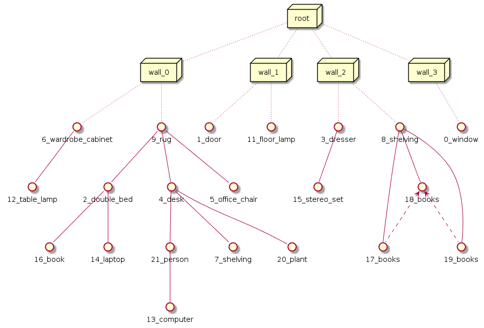

# Dataset Structure

## How to read

Use JSON package to load file

```
import json
f = open('[YOUR_DIR]/data/[ROOM_TYPE]_data.json')
valid_rooms = json.load(f)
```

## Data Structure:

- `valid_rooms` is a list = `[room_1, room_2, .., room_i, ...]`

- For each `room_i`, it's a dictionary organized as

    - `idx` _int_ : index of the room
    - `room_scene_id` _string_ : scene ID which this room belongs to in SUNCG dataset
    - `room_model_id` _string_ : room floor ID of the scene in SUNCG dataset
    - `room_type` _string_ : room type
    - `node_list` _dict_ : a dictionary consists of all nodes(objects) in this room. 
                            Each key represents a node - _key_ is the node's name and _val_ is its feature.
    
        - `KEYS`: node's ID, such as `18_shelving`, `wall_0`, organized as _index_category_.
        - `VALUES`: a dictionary consists of this node's features
        
            - `co-occurrence` _list_ : a list of node's ids which are in neighbor of this node, especially for `root` and `wall` nodes 
            _(notice that this is not the `next-to` relation mentioned in the paper)_
            - `support` _list_ : a list of node's ids which are supported by this node
            - `surround` _list_ : a list of dictionaries whose key and value are the two node's ids surrounding this node. 
                For example: 
                ```json
                {
                  "15_bed":{
                    "surround":[
                      {"6_nightstand":"7_nightstand"}, 
                      {"9_lamp":"10_lamp"}
                    ]
                  }
                 }
                ```
                It means a pair of nightstands and a pair of lamps are surrounding a bed.
            - `self_info` : a dictionary consists of node's transform and id information for itself.
            
                - `type` : type of the node, choice of [`'root'`, `'wall'`, `'node'`]
                - `node_model_id` : model id of this node (you can look it up in this [file](preprocess/SUNCG_id2type.csv), 2nd column)
                - `dim` _vector3_ : dimension of the node
                - `translation` _vector3_ : absolute position of this node
                - `rotation` _vector9_ : unwrapped 3x3 rotation matrix of this node  

- An example visualization for a bedroom data structure . `co-occurence` in dense dash lines, `support` in solid lines, `surround` in dash arrow lines.

    
    
- To notice that, this is the original data structure we load for some preprocessing steps. 
The `Supporting`, `Supported-by`, `Surrounding`, `Surrounded-by`, `Next-to`, `Co-occuring` relationships are later defined in the training process.